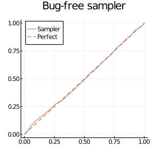
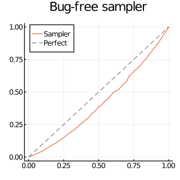

# MCMCDebugging.jl: debugging utilities for MCMC samplers

This package implements a few utilities for debugging MCMC samplers, which includes

- Geweke test
  - See the references [1,2] or [this blog](https://lips.cs.princeton.edu/testing-mcmc-code-part-2-integration-tests/) for details
- [ ] Central limit theorem test

## Examples

We start by defining a fake model, two fake samplers and some functions to use.

```julia
using Distributions, MCMCDebugging, Plots

dim_θ, dim_x = 1, 3
# Fake model and sampler
dist_θ = MvNormal(zeros(dim_θ), ones(dim_θ))
dist_x_given(θ) = MvNormal(ones(dim_x), ones(dim_x))
dist_θ_given(x) = dist_θ

# Marginal-conditional simulator
rand_θ() = rand(dist_θ)
rand_x_given(θ) = rand(dist_x_given(θ))
# Successive-conditional simulator (bug-free sampler)
rand_θ_given(x) = rand(dist_θ_given(x))
# Buggy sampler
rand_θ_given_buggy(x) = rand(dim_θ)

# Log-joint and test function
logjoint(θ, x) = logpdf(dist_θ, θ) + logpdf(dist_x_given(θ), x)
g(θ, x) = cat(θ, x; dims=1)
```

You can perform the Geweke test for the bug-free sampler via

```julia
res = perform(GewekeTest(2_000), rand_θ, rand_x_given, rand_θ_given, g)
```

```julia
Geweke (Joint Distribution) Test
--------------------------------
Results:
    Number of samples: 2000
    Parameter dimension: 1
    Data dimension: 3
    Statistic: [-1.1707037922907118, 1.2325275217058613, 1.7448487069977408, 0.6705977622612224]
```

Plotting functionality is supported via Plots.jl

```julia
plot(res, logjoint; size=(300, 300), title="Bug-free sampler")
```



Let's try Geweke test on the buggy sampler now.

```julia
res_buggy = perform(GewekeTest(2_000), rand_θ, rand_x_given, rand_θ_given_buggy)
```

```julia
┌ Warning: Test function `g` is not provided. Statistic is not computed.
└ @ MCMCDebugging /afs/inf.ed.ac.uk/user/s16/s1672897/projects/ParallelHMC/src/MCMCDebugging.jl/src/geweke.jl:68
Geweke (Joint Distribution) Test
--------------------------------
Results:
    Number of samples: 2000
    Parameter dimension: 1
    Data dimension: 3
    Statistic: missing

Test statistic is missing. Please use `compute_statistic!(res, g)` 
if you want compute statistic without rerun the simulation.
```

Oops -- I also didn't passing the testing function `g`.
Let's follow the recommendation to update the result.

```julia
compute_statistic!(res_buggy, g)
```

```julia
Geweke (Joint Distribution) Test
--------------------------------
Results:
    Number of samples: 2000
    Parameter dimension: 1
    Data dimension: 3
    Statistic: [-43.627860921954095, -1.107109188129648, -0.7516230826915486, -0.7754936191345523]
```

Notably the visualization is very informative:

```julia
plot(res_buggy, logjoint; size=(300, 300), title="Bug-free sampler")
```



You can also check the maximum mean discrepancy (MMD) using the two results.

```julia
@info "MMD" mmd_of(res) mmd_of(res_buggy)
```

```julia
┌ Info: MMD
│   mmd_of(res) = 0.0003698889046864773
│   mmd_of(res_buggy) = 0.03647109991710107
└ @ Main In[35]:1
```

As you can see, the bug-free one attains much smaller value.

## TODOs

- [ ] Interface with [DynamicPPL.jl](https://github.com/TuringLang/DynamicPPL.jl) so that `rand_θ` and `rand_x_given` can be automatically generated.
- [ ] Interface with [AbstractMCMC.jl](https://github.com/TuringLang/AbstractMCMC.jl) so that `rand_θ_given` can be automatically generated.
- [ ] Support KSD for Geweke test via [KernelGoodnessOfFit.jl](https://github.com/torfjelde/KernelGoodnessOfFit.jl/tree/master/src).
  - MMD seems to work quite well so I would expect KSD to work better.

## References

[1] Geweke J. Getting it right: Joint distribution tests of posterior simulators. Journal of the American Statistical Association. 2004 Sep 1;99(467):799-804.
[2] Grosse RB, Duvenaud DK. Testing mcmc code. arXiv preprint arXiv:1412.5218. 2014 Dec 16.
